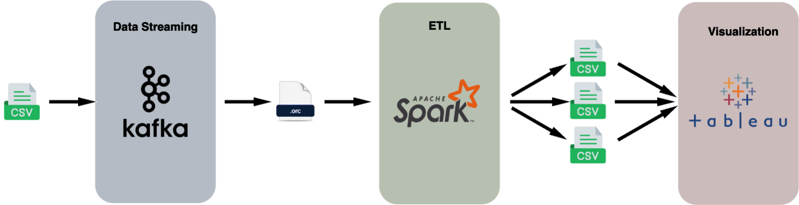
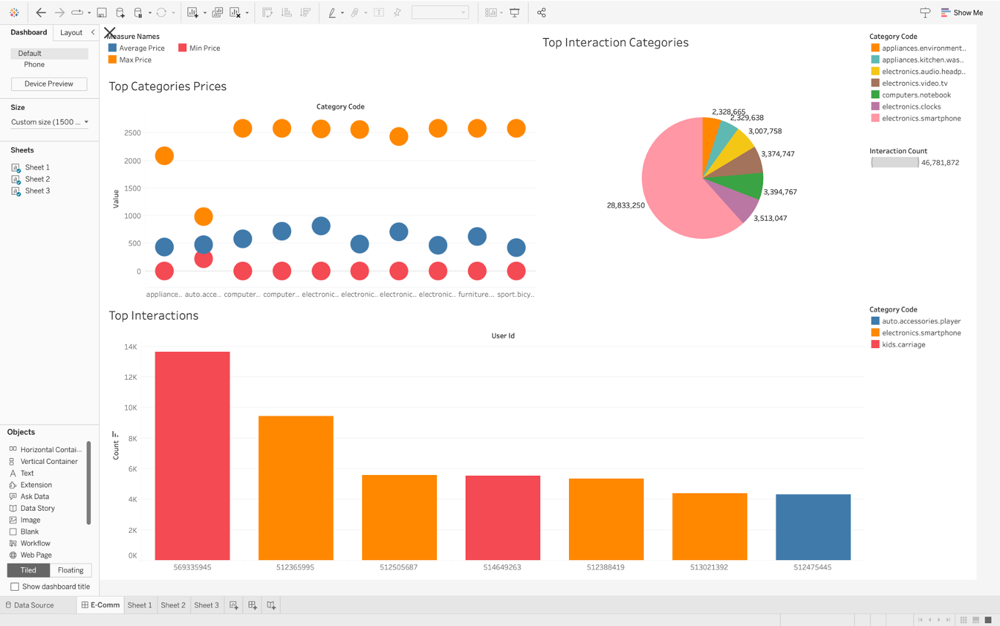

# Data Processing and Storage Pipeline for E-Commerce Behavior Data

# ****Overview****

This project involves building a big data pipeline to source, process, and visualize data. The pipeline consists of multiple steps, including data sourcing using Python, Kafka for data streaming, Apache Spark for ETL processing, and Tableau for data visualization.

# ****Table of Contents****

- [Installation and Usage](#installation-and-usage)
- [Architecture](#architecture)
- [Step 1: Data Sourcing and Kafka Streaming](#step-1-data-sourcing-and-kafka-streaming)
- [Step 2: Apache Spark ETL](#step-2-apache-spark-etl)
- [Step 3: Tableau Visualization](#step-3-tableau-visualization)
- [References](#references)
- [License](#license)

# Installation and Usage

To clone this project, run the following command in your terminal:

```bash
git clone git@github.com:Pradyothsp/bd-pipeline.git
cd bd-pipeline
```

### Creating Virtual Environment

```bash
python3 -m venv .venv
source .venv/bin/activate
```

### Getting Started

Navigate to the project directory and follow the steps below to set up and run the project locally:

### **Prerequisites**

Make sure you have the following software installed:

- Python
- Apache Kafka
- Apache Spark
- Tableau

**Install the required dependencies by running the following command:**

```bash
pip install -r requirements.txt
```

**Installing Kafka:**

Follow these instructions to set up Apache Kafka:

- Download Kafka from [this link](https://kafka.apache.org/downloads).
- Follow the steps in the [Kafka Quickstart Guide](https://kafka.apache.org/quickstart) to start a Kafka broker, create a topic, and produce/consume messages.

**************************Downloading data:**************************

To use the provided data for this project, follow these steps:

1. Visit the following Kaggle link to download the dataset: [E-commerce Behavior Data](https://www.kaggle.com/datasets/mkechinov/ecommerce-behavior-data-from-multi-category-store).
2. Download the dataset from Kaggle by clicking the "Download" button on the dataset page.
3. Extract the contents of the downloaded ZIP file.
4. Move the extracted dataset file(s) to the 'data' folder within your project directory.
5. Open the **[settings.py](https://github.com/Pradyothsp/bd-pipeline/blob/main/settings.py)** file and update the dataset file name variable to match the actual name of the dataset file. Modify the following line in **[settings.py](https://github.com/Pradyothsp/bd-pipeline/blob/main/settings.py)**:

    ```bash
    INPUT_CSV_PATH = ['data/data_2019_Oct.csv', 'data/data_2019_Nov.csv']
    ```

    Replace **`'your_dataset_filename.csv'`** with the actual name of the dataset file you downloaded.

    By following these steps, you'll ensure that the project scripts can access the dataset correctly. If you have any specific questions or need further clarification, feel free to ask.


# Architecture:



# Step 1: Data Sourcing and Kafka Streaming

## ****Running the Kafka Producer and Consumer:****

After setting up Kafka and Kafka Zookeeper, follow these steps to run the Kafka producer and consumer scripts:

### **1. Start Kafka and Zookeeper**

Ensure that Kafka and Zookeeper are up and running. If you haven't started them yet, refer to the Kafka Quickstart Guide mentioned in the [Prerequisites](#prerequisites) section.

### **2. Run the Kafka Producer**

Open a new terminal window and navigate to your project directory.

Run the Kafka producer script:

```bash
python3 producer.py
```

Replace **`your_kafka_topic`** with the Kafka topic you created in **[settings.py](https://github.com/Pradyothsp/bd-pipeline/blob/main/settings.py)**.

### **3. Run the Kafka Consumer**

Open another terminal window and navigate to your project directory.

Run the Kafka consumer script:

```bash
python3 consumer.py
```

By following these steps, you'll be able to test the data streaming from the producer to the consumer through Kafka. Adjust the paths and parameters as needed for your specific setup. If you have any questions or encounter issues, feel free to reach out for assistance.

## Step 2: Apache Spark ETL

In this stage of our "Sales and Customer Insights" project, Apache Spark plays a crucial role in transforming and analyzing the data that resides in Kafka topics.

### **a) Top Category-Brand Combinations for Each User**

To identify and understand user preferences, a custom PySpark script is employed to process real-time data from Kafka topics. Leveraging Spark's distributed computing capabilities, this script determines and prints the top category-brand combination for each user.

The output of this transformation is stored in CSV files, providing nuanced insights into user preferences and interactions with specific product categories and brands.

## **b) Most Engaged Users within Categories and Brands**

Building on the PySpark script, we dive deeper into user engagement metrics. Utilizing Spark's analytical capabilities, the script identifies and highlights the most engaged users within specific categories and brands.

This analysis, stored in CSV files, offers insights into user behavior, enabling targeted marketing and personalized engagement strategies.

## **c) Price Sensitivity within Categories**

Using Spark DataFrame operations, a detailed analysis is conducted to understand user interactions with varying price ranges within different categories. This analysis, stored in ORC files, uncovers patterns related to price sensitivity, revealing if users exhibit preferences for specific price ranges or if certain categories are associated with higher-priced items.

The insights gained in this stage, stored in CSV files, inform pricing strategies and help optimize the product offering within each category.

These PySpark scripts showcase the versatility and power of Apache Spark in processing and analyzing large-scale data, providing actionable insights for strategic decision-making. Customize the input and output paths based on your project structure and requirements. If you have any questions or need further guidance, feel free to reach out.

# Step 3: Tableau Visualization

### **a) Scatterplot for Top 10 Categories Prices**

1. Open Tableau, connect to the CSV file with top 10 category prices.
2. Create a scatterplot to visualize the price distribution.
3. Customize the visualization for effective pricing strategies.

### **b) Pie Chart for Top 10 Interaction Categories**

1. Connect Tableau to the CSV file with user interaction data.
2. Design a pie chart to show the distribution of interactions.
3. Utilize interactive features for marketing insights.

### **c) Bar Chart for Top 10 Interactions**

1. Connect Tableau to the CSV file with interaction data.
2. Create a bar chart to highlight significant interactions.
3. Customize the chart for strategic decision-making.

## **Exploratory Data Analysis (EDA) Using Tableau**

1. Craft Tableau dashboards to explore E-commerce sales history.
2. Use dynamic filters for granular insights into sales dynamics.
3. Perform dynamic segmentation and analysis of the customer base.
4. Visualize detailed product-level analysis for optimized inventory.

Through Tableau's interactive features, analytics, and dashboards, our "Sales and Customer Insights" project provides actionable intelligence for informed strategies.



# **References**

- Apache Kafka: [https://kafka.apache.org/](https://kafka.apache.org/)
- Kafka Visualization Guide: [https://softwaremill.com/kafka-visualisation/](https://softwaremill.com/kafka-visualisation/)
- Apache Spark: [https://spark.apache.org/](https://spark.apache.org/)
- Tableau: [https://www.tableau.com/](https://www.tableau.com/)

## License

**Data Processing and Storage Pipeline for E-Commerce Behavior Data** is licensed under the **MIT License**. See the [LICENSE](https://github.com/Pradyothsp/bd-pipeline/blob/main/LICENSE) file for details.

The MIT License is a permissive open-source license that grants permissions to use, copy, modify, merge, publish, distribute, sublicense, and/or sell copies of the software. It includes a disclaimer of liability and requires that the original copyright notice and the license text must be included in all copies or substantial portions of the software.

You can find more information about the MIT License [here](https://opensource.org/license/mit/).
